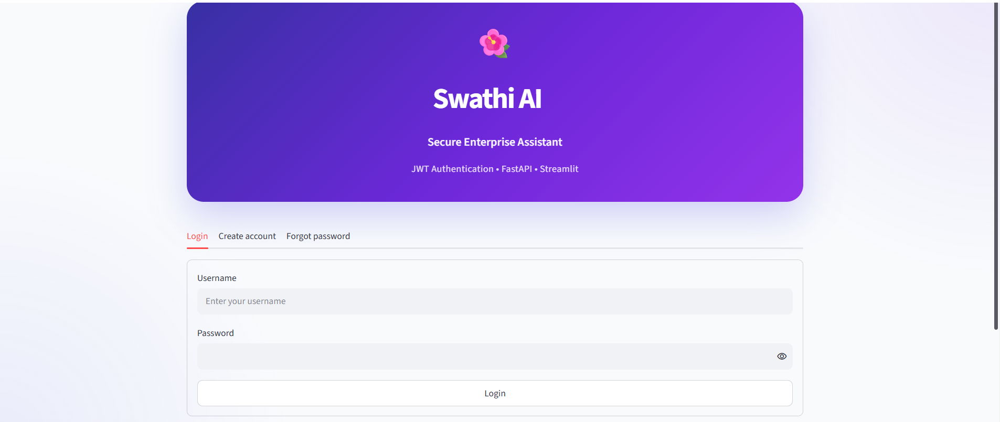
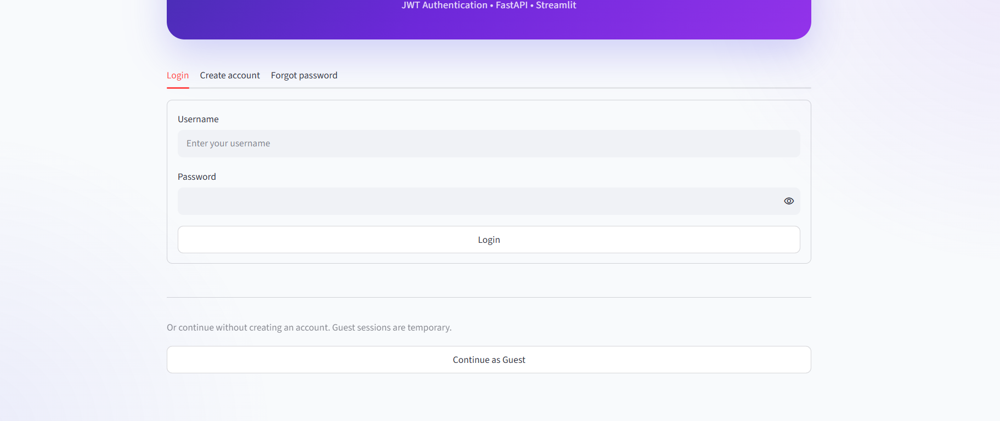
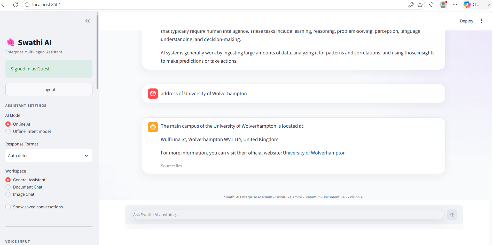
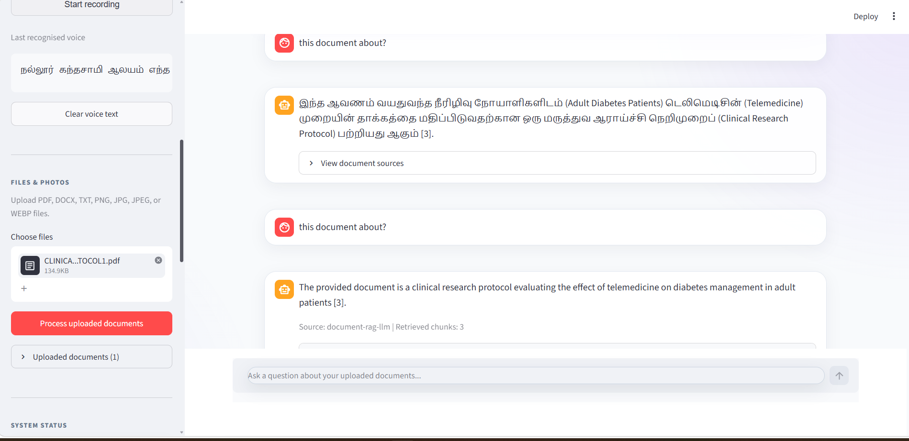

# Swathi AI - Enterprise Multilingual AI Assistant

Swathi AI is a production-deployed multilingual conversational AI platform designed to support **Tamil, Tanglish, and English** interactions.

The system combines intent classification, multilingual language processing, Retrieval-Augmented Generation (RAG), document intelligence, hosted generative AI, authentication, voice input, REST APIs, automated testing, containerisation, and cloud deployment.

The project demonstrates an end-to-end AI engineering workflow from machine-learning inference and backend API development to CI/CD and production deployment.

---

## Application Preview

### Secure Authentication



### AI Conversation



### Tamil, Tanglish and English Support



### Document RAG



---


## Key Features

### Multilingual AI

- Tamil, Tanglish, and English support
- Automatic language handling
- Rule-based routing for deterministic responses
- BERT-based intent classification
- Generative AI fallback for open-ended conversations
- Multilingual response generation

### Retrieval-Augmented Generation

- Document upload and processing
- Semantic document retrieval
- RAG-enhanced responses
- Context-aware question answering
- Document search and management
- Integration between document retrieval and the chat engine

### Authentication

- User registration
- Secure password hashing using PBKDF2-HMAC-SHA256
- Persistent user authentication
- Bearer-token authentication
- Guest login
- Password recovery using secure recovery codes
- Password reset
- Protected API endpoints
- Session expiry

### Voice Interaction

- Browser-based voice input
- Audio conversion and processing
- Speech-to-text support
- Voice interaction integrated with multilingual chat

### Backend API

Built using FastAPI with automatic OpenAPI/Swagger documentation.

Core API functionality includes:

- Health monitoring
- Model status
- User registration
- User login
- Guest authentication
- Current-user authentication
- Password recovery
- Chat
- Document/RAG operations

### Frontend

The Streamlit interface provides:

- Login and account creation
- Guest access
- Forgot-password workflow
- Chat interface
- Voice input
- Multilingual interaction
- Document-based AI functionality

---

## Architecture

```text
                    +----------------------+
                    |    Streamlit UI      |
                    | Web / Voice / Docs   |
                    +----------+-----------+
                               |
                               v
                    +----------------------+
                    |     FastAPI API      |
                    | Auth / Chat / RAG    |
                    +----------+-----------+
                               |
             +-----------------+-----------------+
             |                 |                 |
             v                 v                 v
      +-------------+   +-------------+   +-------------+
      | Intent /    |   | Document    |   | Hosted LLM  |
      | BERT Model  |   | RAG Engine  |   | Provider    |
      +-------------+   +-------------+   +-------------+
             |                 |
             +--------+--------+
                      |
                      v
               +-------------+
               | Chat Engine |
               +-------------+

Authentication:
Streamlit -> FastAPI -> PostgreSQL

Deployment:
GitHub -> GitHub Actions -> Docker -> Azure Container Apps
```

---

## Technology Stack

### AI / Machine Learning

- Python
- BERT / Transformers
- NLP intent classification
- Retrieval-Augmented Generation
- Semantic retrieval
- Hosted generative AI
- Multilingual NLP

### Backend

- FastAPI
- Pydantic
- Uvicorn
- REST API
- OAuth2 Bearer authentication

### Database

- PostgreSQL for production authentication
- SQLite-compatible local development components

### Frontend

- Streamlit
- Python Requests
- Browser-based voice interaction

### DevOps and Cloud

- Docker
- Azure Container Apps
- Azure Container Registry
- GitHub Actions
- GitHub Actions OIDC authentication
- CI/CD

### Testing and Quality

- pytest
- Ruff
- Automated API tests
- Authentication tests
- Continuous integration

---

## Security

Swathi AI implements several security practices:

- Passwords are never stored in plain text
- PBKDF2-HMAC-SHA256 password hashing
- Random per-user password salts
- Cryptographically secure bearer tokens
- Expiring authentication sessions
- Hashed password-recovery codes
- Environment-based secret configuration
- PostgreSQL SSL connections
- Protected authenticated endpoints
- Secrets excluded from Git

Never commit `.env`, database passwords, API keys, or other credentials.

---

## Local Development

### 1. Clone the repository

```bash
git clone <repository-url>
cd swathi-ai
```

### 2. Create a virtual environment

Windows:

```powershell
python -m venv .venv
.venv\Scripts\Activate.ps1
```

### 3. Install dependencies

```powershell
pip install -r requirements-dev.txt
pip install -e .
```

### 4. Configure environment variables

Create a `.env` file based on `.env.example`.

Example:

```env
LLM_BASE_URL=your-provider-base-url
LLM_API_KEY=your-api-key
LLM_MODEL=your-model

AUTH_DB_HOST=your-postgresql-host
AUTH_DB_NAME=your-database
AUTH_DB_USER=your-database-user
AUTH_DB_PASSWORD=your-database-password
```

Do not commit the `.env` file.

---

## Run FastAPI

```powershell
$env:PYTHONPATH="$PWD\src"
python -m uvicorn swathi_ai.api:app --host 127.0.0.1 --port 8002
```

Swagger documentation is available locally at:

```text
http://127.0.0.1:8002/docs
```

---

## Run Streamlit

Open another terminal:

```powershell
$env:API_BASE_URL="http://127.0.0.1:8002"
python -m streamlit run app.py
```

---

## Authentication Flow

### Standard User

```text
Create Account
      |
      v
Recovery Code Generated
      |
      v
Login
      |
      v
Bearer Token
      |
      v
Protected AI Features
```

### Password Recovery

```text
Forgot Password
      |
      v
Username + Recovery Code
      |
      v
Recovery Code Verification
      |
      v
New Password Hash Generated
      |
      v
Password Updated
      |
      v
Login With New Password
```

### Guest User

```text
Continue as Guest
      |
      v
Temporary Guest Token
      |
      v
AI Assistant
```

---

## Testing

Run the complete automated test suite:

```powershell
python -m pytest
```

Current production release:

```text
50 tests passed
```

Run code-quality checks:

```powershell
ruff check src tests app.py
```

---

## Docker

Build the API container:

```bash
docker build -f Dockerfile.api -t swathi-ai-api .
```

The production API is packaged as a Docker container before deployment to Azure Container Apps.

---

## CI/CD Pipeline

Swathi AI uses GitHub Actions for automated cloud deployment.

```text
Developer
    |
    v
Git Push
    |
    v
GitHub
    |
    v
GitHub Actions
    |
    +--> Azure OIDC Authentication
    |
    +--> Docker Build
    |
    +--> Azure Container Registry
    |
    v
Azure Container Apps
    |
    v
Production FastAPI API
```

Each deployment creates a new Azure Container Apps revision, allowing deployment health to be verified independently.

---

## Production Deployment

### Backend

The FastAPI backend is containerised and deployed using:

- Azure Container Apps
- Azure Container Registry
- GitHub Actions

### Frontend

The Streamlit frontend can communicate with the production FastAPI API through the configured `API_BASE_URL`.

---

## API Documentation

FastAPI automatically exposes interactive API documentation through Swagger UI.

Important authentication routes include:

```text
POST /auth/register
POST /auth/login
POST /auth/guest
POST /auth/reset-password
GET  /auth/me
GET  /users/me
```

Additional routes provide chat, model-status, health and document/RAG functionality.

---

## Project Structure

```text
swathi-ai/
|
+-- app.py
+-- Dockerfile.api
+-- docker-compose.yml
+-- pyproject.toml
+-- requirements.txt
+-- requirements-dev.txt
+-- README.md
|
+-- src/
|   +-- swathi_ai/
|       +-- api.py
|       +-- auth.py
|       +-- classifier.py
|       +-- config.py
|       +-- database.py
|       +-- document_service.py
|       +-- engine.py
|       +-- llm.py
|       +-- postgres_auth.py
|       +-- services.py
|
+-- tests/
|
+-- .github/
    +-- workflows/
        +-- deploy-azure.yml
```

---

## Engineering Highlights

This project demonstrates practical experience with:

- End-to-end AI application development
- Multilingual NLP
- Transformer-based intent classification
- Retrieval-Augmented Generation
- REST API engineering
- Secure authentication
- PostgreSQL integration
- Voice-enabled AI interfaces
- Automated software testing
- Docker containerisation
- Cloud deployment
- CI/CD
- Azure infrastructure
- Production debugging and deployment troubleshooting

---

## Release

**Swathi AI v1.0.0**

Production-ready release with multilingual AI, authentication, guest access, password recovery, voice interaction, RAG, automated testing and Azure deployment.

---

## Author

**Swathika**

MSc Artificial Intelligence  
AI / Machine Learning / Software Engineering Portfolio Project
